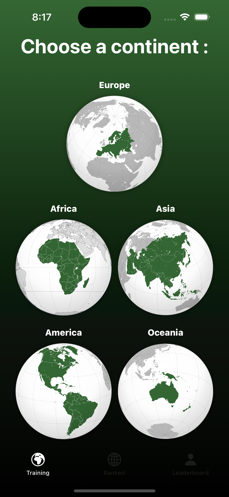
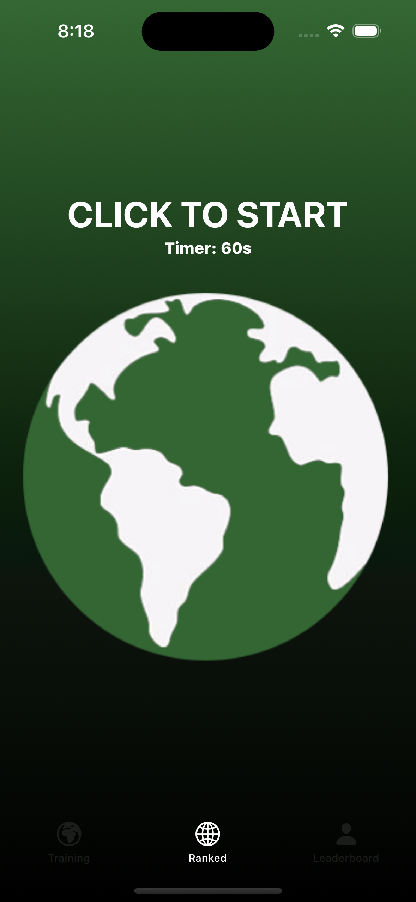
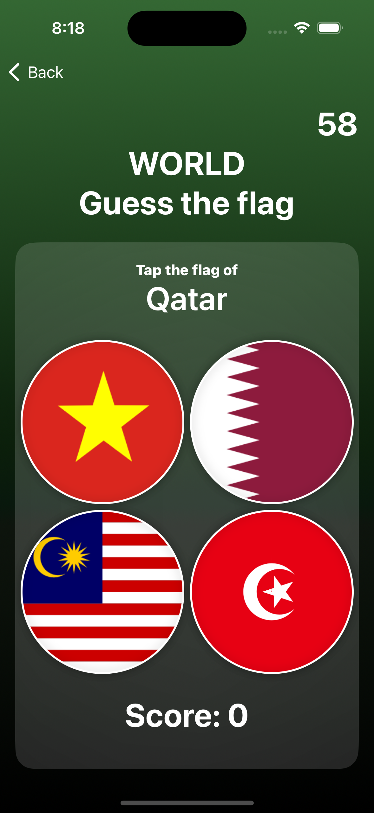

# GuessTheFlag
GuessTheFlag is a simple mobile app game developed using Swift for iOS devices. 
The game challenges players to guess the flag of a country based on a given list of options.

## Features
- *Flag Quiz:* Guess the country associated with the displayed flag.
- *Scoring:* Keep track of your score and try to beat your previous high score.
- *Learn Geography:* Explore flags from around the world.
- *Ranked Mode:* Challenge yourself and try to climb the ladder.

## Screenshots of the game
### Portrait

  
  
  

# TVShowApp

Create a simple application using the [TVmaze API](https://www.tvmaze.com/api).

## TVShowApp v2
Refactor the code after 2 months, using tabView, modifiers and better use of views to improve the app and the code
